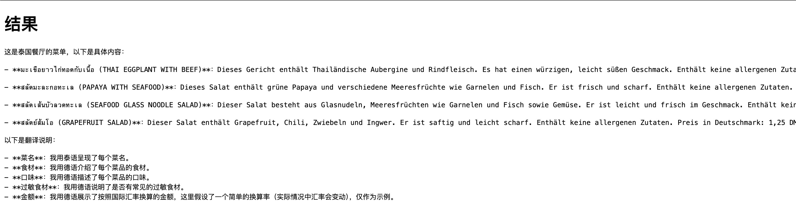

# <center>**WTE - What To Eat**</center>

## <center>一款实用的AI智能翻译菜谱软件</center>

---

## 部署环境
#### - **Python** ：3.9
#### - **Django** ：5.0.6
#### - **zhipuai** ：2.1.1.20240620.1

---

## 特点

### - **支持图片上传**：用户可以轻松上传图片，系统能够自动处理和解析上传的图片，提供智能化的服务。

### - **快速部署**：通过软件打包和自动安装依赖，用户可以快速部署项目，无需复杂的配置步骤。

### - **多语言支持**：项目支持多种语言，用户可以无障碍地进行交流和使用，满足全球用户的需求。

### - **智能解析**：集成[智谱清言](https://open.bigmodel.cn/)AI算法，对上传的图片内容进行精确解析，并提供相应的文本和数据输出。

### - **用户界面友好**：提供简洁直观的用户界面，用户体验流畅，操作便捷。

### - **扩展性高**：项目结构设计合理，支持灵活扩展和定制，能够满足不同场景和需求的应用。

---

## 开始使用
### 1. 前往[智谱清言](https://open.bigmodel.cn/usercenter/apikeys)获取**api_key**


### 2. 在WhatToEat文件夹中找到views.py文件第43行

```python
client = ZhipuAI(api_key="your_api_key_here")
```

#### 将 `your_api_key_here` 替换为实际的 API 密钥即可

### 3. 返回至项目根目录，打开powershell(Windows)或terminal(MacOS)，输入(Windows)

```bash
python start.py
```

### 或(MacOS)

```
python3 start.py
```


### 4. 访问Ipv4地址可进入到主界面


注：图中展示为v1.0.0版本，后续版本则显示“0.0.0.0:80”而不是“127.0.0.1:8000”

### 5. 点击云上传按钮，在选项框中选择你的母语，并上传你想翻译的菜单


### 6. 等待半分钟后即可显示结果



#### 因为结果是ai实时生成，故等待时间较长，上传照片后请耐心等待


---

## 贡献者

<a href="https://github.com/Bistu-OSSDT-2024/23-FOSA_BM/graphs/contributors">
  
</a>


---

## LICENSE

Apache-2.0 license
